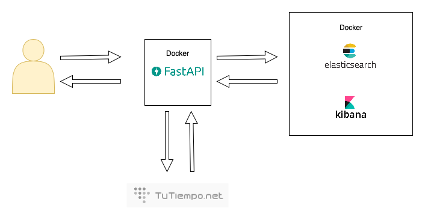

# FastApi Docker

## Process Flows:

We show graphically the different processes of the mixer

## Requirements Virtual Environment:

1. Install virtual environment:
    pip3 install virtualenv
2. Create a virtual environment:
    python3 -m venv venv
3. Activate virtual environment:
    source venv/bin/activate

## Requirements to Create Elastisearch, Kibana and FastApi Docker images:

1. Go to directory when docker-compose.yml is situated.
2. run docker-compose up -d
3. Run uvicorn app.main:app --host "0.0.0.0" --port "8080"
4. Elasticsearch runs **http://localhost:9200**
5. Kibana runs **http://localhost:5601/app/kibana#/home**
6. FastApi Swagger runs **http://localhost:8080/docs**